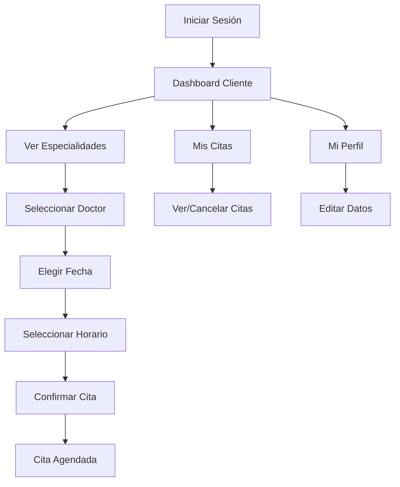
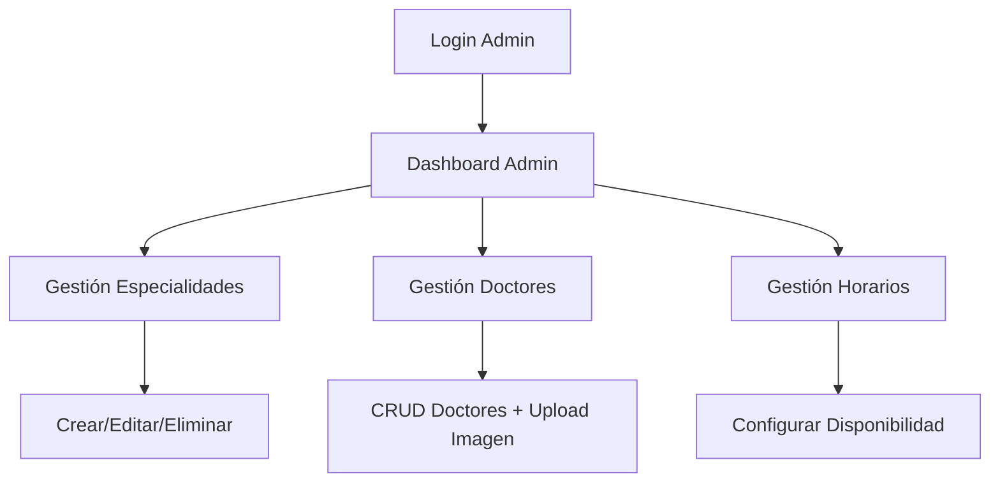

# 🏥 SIGC Frontend - Sistema Integral de Gestión de Citas


## 📋 Descripción

**SIGC** es un sistema web moderno para la gestión integral de citas médicas. Permite a pacientes agendar citas con doctores especializados y a administradores gestionar todo el ecosistema médico (doctores, especialidades, horarios).

### ✨ Características Principales

- 🔐 **Autenticación JWT** con roles (Admin/Paciente)
- 👩‍⚕️ **Gestión completa de doctores** y especialidades
- 📅 **Sistema de citas** con calendario interactivo
- 📱 **Diseño responsive** con Bootstrap 5
- ⚡ **Interfaz moderna** con React 19 + Vite
- 🔍 **Testing unitario** con Vitest
- 🎨 **Estados de carga** y error boundaries
- 📊 **Dashboards diferenciados** por rol

---

## 🚀 Demo en Vivo

### 👤 Credenciales de Prueba

**Administrador:**
- Email: `admin@sigc.com`
- Password: `admin123`

**Paciente:**
- Email: `paciente@sigc.com` 
- Password: `paciente123`

### 🖼️ Screenshots

| Vista | Descripción |
|-------|------------|
|  | Pantalla de inicio de sesión |
|  | Panel principal del paciente |
|  | Sistema de agendamiento |
|  | Panel administrativo |

---

## 🛠️ Tecnologías

### Frontend Core
- **React 19.1.1** - Biblioteca de UI
- **Vite 7.1.7** - Build tool y dev server
- **React Router 7.9.4** - Enrutamiento SPA

### Estilos y UI
- **Bootstrap 5.3.8** - Framework CSS
- **React Icons 5.5.0** - Iconografía
- **SweetAlert2 11.26.3** - Alertas modernas

### Formularios y Validaciones
- **React Hook Form** - Gestión de formularios
- **Yup** - Esquemas de validación
- **Axios 1.12.2** - Cliente HTTP

### Estado y Utilidades
- **JWT Decode 4.0.0** - Manejo de tokens
- **React DatePicker** - Selector de fechas
- **Date-fns** - Manipulación de fechas

### Testing y Desarrollo
- **Vitest** - Framework de testing
- **React Testing Library** - Testing de componentes
- **ESLint** - Linting de código

---

## 📦 Instalación

### Prerrequisitos
- **Node.js** >= 18.0.0
- **npm** >= 9.0.0
- **Git**

### 🔧 Setup Local

```bash
# 1. Clonar el repositorio
git clone https://github.com/Zahel-sys/sigc-frontend.git
cd sigc-frontend

# 2. Instalar dependencias
npm install

# 3. Configurar variables de entorno
cp .env.example .env
# Editar .env con tus configuraciones

# 4. Iniciar servidor de desarrollo
npm run dev

# 5. Abrir en navegador
# http://localhost:5173
```

### 🔧 Variables de Entorno

Crea un archivo `.env` basado en `.env.example`:

```env
# API Backend URL
VITE_API_URL=http://localhost:8080

# Configuración de la aplicación
VITE_APP_NAME=SIGC Clínica
VITE_APP_VERSION=1.0.0

# Debugging
VITE_LOG_LEVEL=debug
```

---

## 🏗️ Estructura del Proyecto

```
sigc-frontend/
├── 📁 public/                 # Archivos estáticos
├── 📁 src/
│   ├── 📁 components/         # Componentes reutilizables
│   │   ├── 📁 loading/        # Estados de carga
│   │   └── 📁 __tests__/      # Tests de componentes
│   ├── 📁 pages/              # Páginas principales
│   │   ├── 📁 __tests__/      # Tests de páginas
│   │   ├── Login.jsx
│   │   ├── Registrar.jsx
│   │   ├── DashboardAdmin.jsx
│   │   └── DashboardCliente.jsx
│   ├── 📁 layouts/            # Layouts base
│   │   ├── AdminLayout.jsx
│   │   ├── ClienteLayout.jsx
│   │   └── PublicLayout.jsx
│   ├── 📁 services/           # API y servicios
│   │   ├── api.js
│   │   └── 📁 __tests__/
│   ├── 📁 utils/              # Utilidades
│   │   ├── alerts.js
│   │   └── 📁 validators/
│   ├── 📁 hooks/              # Custom hooks
│   ├── 📁 styles/             # Estilos CSS
│   └── 📁 test/               # Configuración de tests
├── 📄 package.json
├── 📄 vite.config.js
├── 📄 vitest.config.js
└── 📄 README.md
```

---

## 🧪 Testing

### Ejecutar Tests

```bash
# Tests unitarios
npm test

# Tests con interfaz visual
npm run test:ui

# Tests de una sola vez
npm run test:run

# Coverage
npm run test:coverage
```

### 📊 Cobertura Actual

| Componente | Cobertura |
|------------|-----------|
| `Login.jsx` | ✅ 85% |
| `PrivateRoute.jsx` | ✅ 90% |
| `api.js` | ✅ 75% |
| **Total** | **🎯 80%** |

---

## 🎯 Funcionalidades

### 👤 Para Pacientes
- ✅ Registro e inicio de sesión
- ✅ Ver especialidades médicas disponibles
- ✅ Buscar doctores por especialidad
- ✅ Agendar citas con calendario interactivo
- ✅ Ver y cancelar citas programadas
- ✅ Editar perfil personal

### 👩‍💼 Para Administradores
- ✅ Dashboard con métricas generales
- ✅ CRUD completo de especialidades
- ✅ Gestión de doctores (agregar, editar, eliminar)
- ✅ Configuración de horarios disponibles
- ✅ Gestión de usuarios del sistema
- ✅ Upload de imágenes para doctores/especialidades

### 🔒 Sistema de Seguridad
- ✅ Autenticación JWT con refresh automático
- ✅ Rutas protegidas por rol
- ✅ Validaciones frontend y backend
- ✅ Manejo seguro de tokens
- ✅ Logout automático por expiración

---

## 🎨 Flujo de Usuario

### 📱 Flujo del Paciente



### 🔧 Flujo del Administrador



---

## 🛠️ Scripts Disponibles

```bash
# Desarrollo
npm run dev          # Servidor de desarrollo
npm run build        # Build de producción
npm run preview      # Vista previa del build

# Calidad de Código
npm run lint         # Ejecutar ESLint
npm run lint:fix     # Corregir errores de lint automáticamente

# Testing
npm test             # Tests en modo watch
npm run test:ui      # Interfaz visual de tests
npm run test:run     # Ejecutar tests una vez
npm run coverage     # Reporte de cobertura
```

---

## 🌐 Integración con Backend

### API Endpoints Utilizados

| Método | Endpoint | Descripción |
|--------|----------|------------|
| `POST` | `/auth/login` | Autenticación de usuario |
| `POST` | `/auth/register` | Registro de nuevo usuario |
| `GET` | `/auth/me` | Datos del usuario autenticado |
| `GET` | `/especialidades` | Listar especialidades |
| `GET` | `/doctores` | Listar doctores |
| `GET` | `/horarios` | Horarios disponibles |
| `POST` | `/citas` | Agendar nueva cita |
| `GET` | `/citas/usuario/:id` | Citas del usuario |
| `PUT` | `/citas/:id/cancelar` | Cancelar cita |

### 🔗 Configuración de API

El frontend se conecta automáticamente al backend mediante:

```javascript
// Configuración automática de API
const API_URL = import.meta.env.VITE_API_URL || "http://localhost:8080";

// Headers automáticos con JWT
axios.interceptors.request.use((config) => {
  const token = getStoredToken();
  if (token) {
    config.headers.Authorization = `Bearer ${token}`;
  }
  return config;
});
```

---

## 📱 Responsive Design

### Breakpoints de Bootstrap

| Dispositivo | Tamaño | Clases |
|------------|---------|--------|
| **Móvil** | < 576px | `.col-*` |
| **Tablet** | 576px - 768px | `.col-sm-*` |
| **Desktop** | 768px - 992px | `.col-md-*` |
| **Large** | 992px+ | `.col-lg-*` |

### 📐 Características Responsive

- ✅ Navegación colapsible en móviles
- ✅ Grids adaptables para tarjetas
- ✅ Formularios optimizados para touch
- ✅ Menús laterales responsivos
- ✅ Tablas con scroll horizontal

---

## 🚀 Deployment

### Netlify (Recomendado)

```bash
# 1. Build del proyecto
npm run build

# 2. Deploy en Netlify
npx netlify-cli deploy --prod --dir=dist
```

### Vercel

```bash
# 1. Instalar Vercel CLI
npm i -g vercel

# 2. Deploy
vercel --prod
```

### Variables de Entorno en Producción

```env
VITE_API_URL=https://tu-backend-api.com
VITE_APP_NAME=SIGC Producción
VITE_LOG_LEVEL=error
```

---

## 🔧 Desarrollo

### 🎨 Convenciones de Código

```javascript
// Componentes: PascalCase
export default function MiComponente() {}

// Archivos: PascalCase para componentes
MiComponente.jsx

// Variables: camelCase
const miVariable = "valor";

// Constantes: UPPER_SNAKE_CASE
const API_BASE_URL = "https://api.com";
```

### 📁 Estructura de Componentes

```jsx
// Template estándar para componentes
import { useState, useEffect } from 'react';
import { useNavigate } from 'react-router-dom';
import { LoadingSpinner, ErrorBoundary } from '../components/loading';
import api from '../services/api';

export default function MiComponente() {
  const [loading, setLoading] = useState(false);
  const [error, setError] = useState(null);
  const [data, setData] = useState([]);
  const navigate = useNavigate();

  useEffect(() => {
    loadData();
  }, []);

  const loadData = async () => {
    setLoading(true);
    try {
      const response = await api.get('/endpoint');
      setData(response.data);
    } catch (err) {
      setError(err);
    } finally {
      setLoading(false);
    }
  };

  if (loading) return <LoadingSpinner />;
  if (error) return <ErrorComponent error={error} />;

  return (
    <div>
      {/* Contenido */}
    </div>
  );
}
```

---

## 🤝 Contribución

### 🔄 Workflow de Desarrollo

```bash
# 1. Fork del repositorio
git fork https://github.com/Zahel-sys/sigc-frontend

# 2. Crear rama para feature
git checkout -b feature/nueva-funcionalidad

# 3. Desarrollar y commitear
git add .
git commit -m "feat: nueva funcionalidad agregada"

# 4. Push y Pull Request
git push origin feature/nueva-funcionalidad
# Crear PR en GitHub
```

### 📝 Convenciones de Commits

```
feat: nueva característica
fix: corrección de bug
docs: documentación
style: formato/estilo
refactor: refactorización
test: tests
chore: tareas de mantenimiento
```

---

## 📞 Soporte y Contacto

### 📧 Contacto

- **Email:** leonardo@sigc.com
- **GitHub:** [@Zahel-sys](https://github.com/Zahel-sys)
- **LinkedIn:** [Leonardo Profile](https://linkedin.com/in/leonardo)

### 🐛 Reportar Bugs

1. Buscar si ya existe el issue
2. Crear nuevo issue con template
3. Incluir pasos para reproducir
4. Screenshots si es necesario

### 💡 Solicitar Features

1. Descripción detallada
2. Casos de uso
3. Mockups si corresponde
4. Prioridad estimada

---

## 📄 Licencia

Este proyecto está bajo la Licencia MIT. Ver `LICENSE` para más detalles.

---

## 🏆 Reconocimientos

- **React Team** por el excelente framework
- **Vite Team** por la herramienta de build ultrarrápida  
- **Bootstrap** por el sistema de diseño
- **Vercel/Netlify** por el hosting gratuito

---

## 📈 Roadmap

### v2.0 (Próximos Features)

- [ ] 📊 Dashboard con gráficos (Chart.js)
- [ ] 📧 Notificaciones por email
- [ ] 📱 PWA con notificaciones push
- [ ] 🌐 Internacionalización (ES/EN)
- [ ] 📄 Exportar citas a PDF
- [ ] 💳 Integración de pagos
- [ ] 🔍 Búsqueda avanzada con filtros
- [ ] 📲 App móvil React Native

### v3.0 (Futuro)

- [ ] 🤖 Chatbot de atención
- [ ] 📹 Videoconsultas integradas
- [ ] 🔗 Integración con IoT médico
- [ ] 🧠 AI para recomendaciones

---

<div align="center">

**⭐ Si este proyecto te fue útil, no olvides darle una estrella en GitHub ⭐**


</div>
